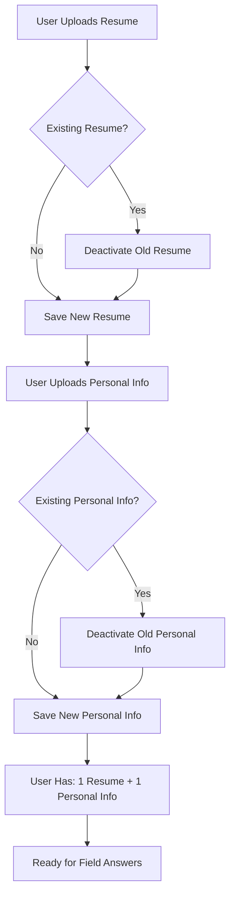

# 📚 Smart Form Fill API - Document CRUD Endpoints

**ONE RESUME + ONE PERSONAL INFO PER USER**

Complete API documentation for document upload and management endpoints.

## 🎯 Overview

The API implements a **"one per user"** document model:

- **Resume Documents**: Each user can have ONE active resume (PDF, DOCX, DOC, TXT)
- **Personal Information**: Each user can have ONE active personal info document
- **Auto-Replace**: Uploading new documents automatically replaces previous ones
- **Simplified Endpoints**: No document IDs needed since there's only one per type per user

## 🔐 Authentication

Most endpoints require authentication using JWT tokens:

```http
Authorization: Bearer <your-jwt-token>
```

Demo endpoints (prefixed with `/api/demo/`) do not require authentication.

## 📄 Resume Document Endpoints (ONE PER USER)

### Upload Resume (Replaces Previous)

```http
POST /api/v1/resume/upload
```

**Headers:**

- `Authorization: Bearer <token>`
- `Content-Type: multipart/form-data`

**Body (Form Data):**

- `file`: Resume file (PDF, DOCX, DOC, TXT)

**Response:**

```json
{
  "status": "success",
  "message": "Resume 'john_doe_resume.pdf' uploaded successfully (replaced previous resume)",
  "document_id": 5,
  "filename": "john_doe_resume.pdf",
  "processing_time": 0.15,
  "file_size": 245760,
  "replaced_previous": true
}
```

### Get User's Resume

```http
GET /api/v1/resume
```

**Response:**

```json
{
  "id": 5,
  "filename": "john_doe_resume.pdf",
  "file_size": 245760,
  "processing_status": "completed",
  "is_active": true,
  "created_at": "2024-01-15T10:30:00Z",
  "last_processed_at": "2024-01-15T10:31:00Z",
  "user_id": "user123"
}
```

### Download User's Resume

```http
GET /api/v1/resume/download
```

**Response:**

- Returns the user's resume file with appropriate headers for download

### Delete User's Resume

```http
DELETE /api/v1/resume
```

**Response:**

```json
{
  "status": "success",
  "message": "Resume deleted successfully"
}
```

## 📝 Personal Information Endpoints (ONE PER USER)

### Upload Personal Information (Replaces Previous)

```http
POST /api/v1/personal-info/upload
```

**Headers:**

- `Authorization: Bearer <token>`
- `Content-Type: application/x-www-form-urlencoded`

**Body (Form Data):**

- `title`: Title for the information (e.g., "Contact Information")
- `content`: The personal information content (text)

**Response:**

```json
{
  "status": "success",
  "message": "Personal info 'Contact Information' uploaded successfully (replaced previous personal info)",
  "document_id": 8,
  "filename": "Contact Information",
  "processing_time": 0.08,
  "file_size": 1024,
  "replaced_previous": true
}
```

### Get User's Personal Information

```http
GET /api/v1/personal-info
```

**Response:**

```json
{
  "id": 8,
  "title": "Contact Information",
  "content": "Name: John Doe\nEmail: john@example.com\n...",
  "content_length": 1024,
  "processing_status": "completed",
  "is_active": true,
  "created_at": "2024-01-15T10:35:00Z",
  "last_processed_at": "2024-01-15T10:36:00Z",
  "user_id": "user123"
}
```

### Update User's Personal Information

```http
PUT /api/v1/personal-info
```

**Body (Form Data):**

- `title`: Updated title
- `content`: Updated content

**Response:**

```json
{
  "status": "success",
  "message": "Personal info updated successfully"
}
```

### Delete User's Personal Information

```http
DELETE /api/v1/personal-info
```

**Response:**

```json
{
  "status": "success",
  "message": "Personal info deleted successfully"
}
```

## 📊 User Document Status

### Get User's Documents Status

```http
GET /api/v1/documents/status
```

**Response:**

```json
{
  "status": "success",
  "timestamp": "2024-01-15T10:40:00Z",
  "data": {
    "user_id": "user123",
    "resume": {
      "id": 5,
      "filename": "john_doe_resume.pdf",
      "file_size": 245760,
      "processing_status": "completed",
      "created_at": "2024-01-15T10:30:00Z",
      "last_processed_at": "2024-01-15T10:31:00Z"
    },
    "personal_info": {
      "id": 8,
      "title": "Contact Information",
      "content_length": 1024,
      "processing_status": "completed",
      "created_at": "2024-01-15T10:35:00Z",
      "last_processed_at": "2024-01-15T10:36:00Z"
    },
    "summary": {
      "has_resume": true,
      "has_personal_info": true,
      "documents_ready": true,
      "resume_status": "completed",
      "personal_info_status": "completed"
    }
  }
}
```

## 🎯 Demo Endpoints (No Authentication)

### Demo Resume Upload

```http
POST /api/demo/resume/upload
```

Same as authenticated endpoint but uses `user_id: "default"`

### Demo Resume Get

```http
GET /api/demo/resume
```

**Response:**

```json
{
  "status": "success",
  "data": {
    "id": 5,
    "filename": "john_doe_resume.txt",
    "file_size": 1024,
    "processing_status": "completed",
    "is_active": true,
    "created_at": "2024-01-15T10:30:00Z",
    "last_processed_at": "2024-01-15T10:31:00Z",
    "user_id": "default"
  }
}
```

### Demo Resume Download

```http
GET /api/demo/resume/download
```

**Response:**

- Returns the demo resume file with appropriate headers for download

### Demo Personal Info Upload

```http
POST /api/demo/personal-info/upload
```

Same as authenticated endpoint but uses `user_id: "default"`

### Demo Personal Info Get

```http
GET /api/demo/personal-info
```

**Response:**

```json
{
  "status": "success",
  "data": {
    "id": 8,
    "title": "Contact Information & Preferences",
    "content": "CONTACT INFORMATION:\nName: John Doe\nEmail: john.doe@email.com\n...",
    "content_length": 1024,
    "processing_status": "completed",
    "is_active": true,
    "created_at": "2024-01-15T10:35:00Z",
    "last_processed_at": "2024-01-15T10:36:00Z",
    "user_id": "default"
  }
}
```

### Demo Documents Status

```http
GET /api/demo/documents/status
```

**Response:**

```json
{
  "status": "success",
  "timestamp": "2024-01-15T10:40:00Z",
  "data": {
    "user_id": "default",
    "resume": {
      "id": 5,
      "filename": "john_doe_resume.txt",
      "file_size": 1024,
      "processing_status": "completed",
      "created_at": "2024-01-15T10:30:00Z",
      "last_processed_at": "2024-01-15T10:31:00Z"
    },
    "personal_info": {
      "id": 8,
      "title": "Contact Information & Preferences",
      "content_length": 1024,
      "processing_status": "completed",
      "created_at": "2024-01-15T10:35:00Z",
      "last_processed_at": "2024-01-15T10:36:00Z"
    },
    "summary": {
      "has_resume": true,
      "has_personal_info": true,
      "documents_ready": true,
      "resume_status": "completed",
      "personal_info_status": "completed"
    }
  }
}
```

## 🔄 Processing Endpoints

### Re-embed Resume

```http
POST /api/v1/resume/reembed?user_id=default
```

**Response:**

```json
{
  "status": "success",
  "message": "Resume re-embedded successfully from database in 2.15s",
  "processing_time": 2.15,
  "database_info": {
    "user_id": "default",
    "chunks_processed": 15,
    "embeddings_created": 15,
    "vector_dimension": 1536,
    "optimization_enabled": true
  }
}
```

### Re-embed Personal Info

```http
POST /api/v1/personal-info/reembed?user_id=default
```

Similar response structure as resume re-embedding.

## 🔧 Field Answer Generation

### Generate Field Answer (Authenticated)

```http
POST /api/generate-field-answer
```

**Headers:**

- `Authorization: Bearer <token>`

**Body:**

```json
{
  "label": "What's your email address?",
  "url": "https://example.com/job-application"
}
```

**Response:**

```json
{
  "answer": "john@example.com",
  "data_source": "personal_info_vectordb",
  "reasoning": "Found email address from personal information database",
  "status": "success",
  "performance_metrics": {
    "processing_time_seconds": 0.8,
    "optimization_enabled": true,
    "cache_hits": 2,
    "database_queries": 1
  }
}
```

### Demo Field Answer (No Authentication)

```http
POST /api/demo/generate-field-answer
```

Same request/response format but uses default user data.

## 📝 File Format Support

### Resume Documents

- **PDF**: `application/pdf`
- **DOCX**: `application/vnd.openxmlformats-officedocument.wordprocessingml.document`
- **DOC**: `application/msword`
- **TXT**: `text/plain`

### Size Limits

- **Resume files**: 10MB maximum
- **Personal info text**: 50KB maximum

## 🚨 Error Responses

### 400 Bad Request

```json
{
  "detail": "Unsupported file type: application/zip. Supported: PDF, DOCX, DOC, TXT"
}
```

### 401 Unauthorized

```json
{
  "detail": "Could not validate credentials"
}
```

### 404 Not Found

```json
{
  "detail": "No resume found for this user"
}
```

### 500 Internal Server Error

```json
{
  "detail": "Upload failed: Database connection error"
}
```

## 🧪 Testing

Run the test script to verify all endpoints:

```bash
python test_upload_api.py
```

This will:

1. Upload a demo resume
2. Upload demo personal information
3. Test document replacement behavior
4. Re-embed both documents for vector search
5. Check document status
6. Test field answer generation

## 📊 One-Per-User Logic Flow



## 🔄 Complete CRUD Workflow (One Per User)

1. **Create**: Upload documents via `/upload` endpoints
   - Automatically replaces any existing document of the same type
2. **Read**: Get user's single document via base endpoints (no IDs needed)
3. **Update**: Modify personal info via `PUT` endpoint
4. **Delete**: Remove user's document via `DELETE` endpoints
5. **Process**: Re-embed for vector search via `/reembed` endpoints
6. **Use**: Generate field answers using the user's documents

## 🎯 Key Benefits of One-Per-User Logic

- **Simplified API**: No need to manage document IDs
- **Automatic Management**: Old documents are automatically replaced
- **Consistent State**: Users always have at most one of each document type
- **Clear Endpoints**: `/api/v1/resume` always refers to the user's resume
- **Reduced Complexity**: No need to choose between multiple documents

## 🎯 Integration with Frontend

Your Chrome extension can now:

1. **Upload documents** during setup (automatically replaces old ones)
2. **Check status** to verify documents are ready
3. **Generate field answers** using the user's current documents
4. **Update personal info** as needed
5. **No document ID management** required

The API enforces the "one per user" constraint at the database level, ensuring data consistency and simplifying the user experience.
