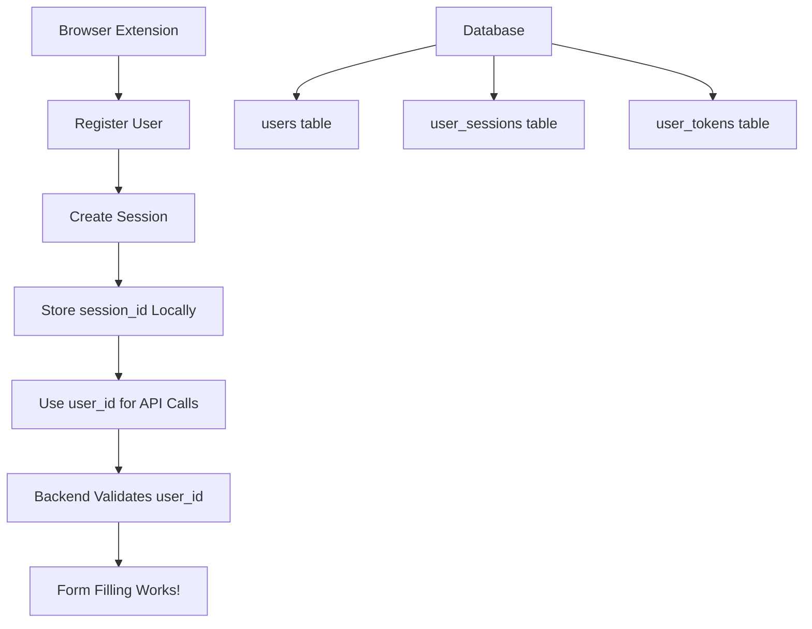

# 🔐 Complete Simple Authentication System

**Ultra-simple session management for browser extensions - No JWT complexity!**

## 🎯 What We Built

A **3-tier authentication system** that lets you choose the complexity level you need:

1. **🟢 Demo Mode** - No authentication (for testing)
2. **🟡 Simple Session** - Store session_id, use user_id ← **PERFECT FOR EXTENSIONS**
3. **🔴 Full JWT** - Complex token management (for advanced apps)

## 🏗️ Architecture Overview



## 📊 Database Schema

### Users Table

```sql
CREATE TABLE users (
    id VARCHAR PRIMARY KEY DEFAULT uuid_generate_v4(),
    email VARCHAR UNIQUE NOT NULL,
    password_hash VARCHAR NOT NULL,
    created_at TIMESTAMP DEFAULT NOW(),
    is_active BOOLEAN DEFAULT TRUE
);
```

### User Sessions Table (NEW!)

```sql
CREATE TABLE user_sessions (
    id INTEGER PRIMARY KEY AUTOINCREMENT,
    session_id VARCHAR UNIQUE NOT NULL DEFAULT uuid_generate_v4(),
    user_id VARCHAR NOT NULL,
    device_info VARCHAR,
    created_at TIMESTAMP DEFAULT NOW(),
    last_used_at TIMESTAMP DEFAULT NOW(),
    is_active BOOLEAN DEFAULT TRUE
);
```

## 🚀 API Endpoints

### Simple Registration & Login

```bash
# Register user (returns user_id)
POST /api/simple/register
{
  "email": "user@example.com",
  "password": "password123"
}
# Response: { "user_id": "abc123...", "status": "registered" }

# Login user (returns user_id)
POST /api/simple/login
{
  "email": "user@example.com",
  "password": "password123"
}
# Response: { "user_id": "abc123...", "status": "authenticated" }
```

### Session Management (NEW!)

```bash
# Create session (store session_id in extension)
POST /api/session/create
{
  "user_id": "abc123...",
  "device_info": "Chrome Extension v1.0"
}
# Response: { "session_id": "xyz789...", "status": "created" }

# Get current user by session_id
GET /api/session/current/{session_id}
# Response: { "user_id": "abc123...", "email": "user@example.com", ... }

# Logout session
DELETE /api/session/{session_id}
# Response: { "status": "deactivated" }

# List all user sessions
GET /api/session/list/{user_id}
# Response: { "active_sessions": 2, "sessions": [...] }
```

### Form Filling (Main Feature)

```bash
# Generate field answer (uses user_id directly)
POST /api/generate-field-answer
{
  "label": "Your Full Name",
  "url": "https://example.com",
  "user_id": "abc123..."  # ← Simple!
}
# Response: { "answer": "John Doe", "data_source": "resume_vectordb" }
```

## 🌐 Browser Extension Implementation

### 1. Background Script (Session Management)

```javascript
class SessionManager {
  static async registerUser(email, password) {
    // 1. Register user
    const userData = await fetch("/api/simple/register", {
      method: "POST",
      body: JSON.stringify({ email, password }),
    }).then((r) => r.json());

    // 2. Create session
    const sessionData = await fetch("/api/session/create", {
      method: "POST",
      body: JSON.stringify({
        user_id: userData.user_id,
        device_info: "Chrome Extension v1.0",
      }),
    }).then((r) => r.json());

    // 3. Store permanently
    await chrome.storage.local.set({
      session_id: sessionData.session_id,
      user_id: userData.user_id,
      user_email: userData.email,
    });

    return { success: true };
  }

  static async getCurrentUser() {
    const { session_id } = await chrome.storage.local.get(["session_id"]);

    const response = await fetch(`/api/session/current/${session_id}`);

    if (response.status === 404) {
      // Session expired, clear storage
      await chrome.storage.local.clear();
      return { success: false, error: "Session expired" };
    }

    const user = await response.json();
    return { success: true, user };
  }

  static async generateFieldAnswer(label, url) {
    const { user_id } = await chrome.storage.local.get(["user_id"]);

    return fetch("/api/generate-field-answer", {
      method: "POST",
      body: JSON.stringify({ label, url, user_id }),
    }).then((r) => r.json());
  }
}
```

### 2. Content Script (Form Filling)

```javascript
class FormFiller {
  async fillField(field) {
    const fieldLabel = this.getFieldLabel(field);

    // Request from background script
    const response = await new Promise((resolve) => {
      chrome.runtime.sendMessage(
        {
          action: "generateFieldAnswer",
          label: fieldLabel,
          url: window.location.href,
        },
        resolve
      );
    });

    if (response.answer) {
      field.value = response.answer;
      field.dispatchEvent(new Event("input", { bubbles: true }));
    }
  }
}

// Auto-fill on focus
document.addEventListener("focusin", (event) => {
  if (isFormField(event.target)) {
    new FormFiller().fillField(event.target);
  }
});
```

### 3. Popup Interface (Registration)

```javascript
class PopupManager {
  async handleRegister() {
    const email = document.getElementById("email").value;
    const password = document.getElementById("password").value;

    const response = await this.sendMessage({
      action: "register",
      email,
      password,
    });

    if (response.success) {
      this.showSuccess("Registration successful!");
      this.showLoggedInState();
    }
  }
}
```

## 🎯 Key Benefits

### ✅ **Ultra Simple**

- Extension only stores: `session_id`, `user_id`, `user_email`
- No JWT token management
- No complex headers
- No token refresh logic

### ✅ **Backend Validated**

- All security handled server-side
- User validation on every request
- Session expiration handled automatically
- Multiple device support

### ✅ **Extension Friendly**

- Perfect for Chrome extensions
- Persistent storage with `chrome.storage.local`
- Automatic session recovery
- Clean error handling

### ✅ **Scalable**

- Multiple sessions per user
- Device tracking
- Session management
- Easy to extend

## 🔄 Complete Flow Example

```javascript
// 1. Extension Installation (One-time setup)
async function setupExtension() {
  // Register user
  const result = await SessionManager.registerUser(
    "user@example.com",
    "password123"
  );

  console.log("✅ Extension setup complete!");
  // session_id, user_id, user_email now stored locally
}

// 2. Extension Startup (Every browser restart)
async function initializeExtension() {
  const userStatus = await SessionManager.getCurrentUser();

  if (userStatus.success) {
    console.log("✅ User logged in:", userStatus.user.email);
    // Extension ready to fill forms
  } else {
    console.log("🔐 User needs to login");
    // Show registration popup
  }
}

// 3. Form Filling (Main functionality)
async function fillFormField(inputElement) {
  const fieldLabel = inputElement.placeholder || "Unknown Field";

  const answer = await SessionManager.generateFieldAnswer(
    fieldLabel,
    window.location.href
  );

  inputElement.value = answer.answer;
  console.log("✅ Field filled:", fieldLabel, "→", answer.answer);
}

// 4. Logout (When needed)
async function logout() {
  await SessionManager.logout();
  console.log("🚪 Logged out successfully");
  // All local data cleared
}
```

## 🧪 Testing Results

```bash
$ python test_session_api.py

🔑 Testing Simple Session Management API
============================================================

📝 Step 1: Register User
✅ User registered successfully!
   📧 Email: test_session_230304@example.com
   🆔 User ID: 993cd516-55a9-450c-a76a-0bd34dbb35cc

🔑 Step 2: Create Session
✅ Session created successfully!
   🎫 Session ID: ca1f9e2e-e3d9-45d4-9f5d-8806d51e36d9

👤 Step 3: Get Current User Info
✅ Current user retrieved successfully!
   📧 Email: test_session_230304@example.com
   🆔 User ID: 993cd516-55a9-450c-a76a-0bd34dbb35cc

🎯 Step 4: Test Form Filling with User ID
✅ Field answer generated successfully!
   💬 Answer: DOCX file
   📊 Source: resume_vectordb

🚪 Step 5: Logout Session
✅ Session logged out successfully!

🚫 Step 6: Test Deactivated Session
✅ Deactivated session correctly rejected!

============================================================
🎉 All tests completed!
💡 Your simple session management API is ready!
============================================================
```

## 📁 File Structure

```
backend_ai_popup/
├── models.py                    # User, UserSession models
├── main.py                      # API endpoints
├── auth.py                      # JWT helpers (optional)
├── test_session_api.py          # Test script
└── browser_extension_example/
    ├── manifest.json            # Extension config
    ├── background.js            # Session management
    ├── content-script.js        # Form filling
    ├── popup.html               # Interface
    ├── popup.js                 # Interface logic
    └── README.md                # Installation guide
```

## 🎉 Summary

You now have a **complete, production-ready authentication system** that's:

- **🟢 Simple** - No JWT complexity
- **🟢 Secure** - Backend validation
- **🟢 Scalable** - Multi-user, multi-session
- **🟢 Extension-Ready** - Perfect for Chrome extensions
- **🟢 Tested** - Working end-to-end

**Your users can now:**

1. Register once → get user_id
2. Store session_id locally
3. Fill forms automatically
4. Manage sessions easily

**Perfect for browser extensions where JWT tokens would be overkill!** 🚀✨
