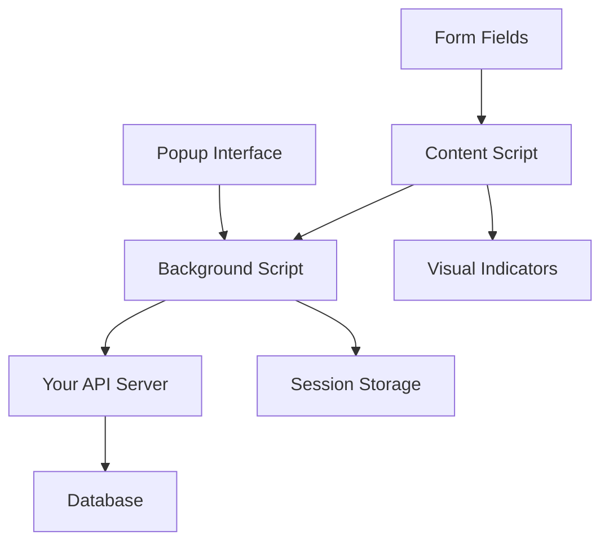

# 🤖 Smart Form Filler - Browser Extension

**AI-powered form filling with ultra-simple session management**

## 🚀 Features

- **🔑 Simple Authentication** - No JWT tokens, just session_id storage
- **🎯 Auto Form Filling** - Focus on any field to auto-fill
- **📱 Smart Field Detection** - Supports various input types and labels
- **⚡ Real-time Processing** - Fast AI-powered responses
- **🎨 Visual Indicators** - See filling progress with emojis
- **⌨️ Keyboard Shortcuts** - Ctrl+Shift+F for manual fill
- **🧪 Test Mode** - Built-in form tester

## 📋 Installation

### 1. Load Extension in Chrome

1. Open Chrome and go to `chrome://extensions/`
2. Enable "Developer mode" (top right toggle)
3. Click "Load unpacked"
4. Select the `browser_extension_example` folder
5. The extension icon should appear in your toolbar

### 2. Start Your API Server

```bash
cd backend_ai_popup
source venv/bin/activate
python -m uvicorn main:app --reload --host 0.0.0.0 --port 8000
```

### 3. Register & Login

1. Click the extension icon in your toolbar
2. Enter your email and password
3. Click "Register & Login"
4. You're ready to go! 🎉

## 🎯 How to Use

### Auto-Fill Mode (Default)

- Navigate to any website with forms
- Click on any form field (name, email, phone, etc.)
- Watch it auto-fill with your information! ✨

### Manual Fill Mode

- Focus on any form field
- Press `Ctrl + Shift + F`
- Field will be filled instantly

### Test Mode

- Click the extension icon
- Click "🧪 Test Form Fill"
- A test form will appear on the current page
- Try focusing on the fields!

## 🏗️ Architecture



### Components

1. **`manifest.json`** - Extension configuration
2. **`background.js`** - Session management & API communication
3. **`content-script.js`** - Form detection & filling logic
4. **`popup.html/js`** - User interface & registration
5. **Your API** - AI form filling backend

## 🔧 Configuration

### API URL Configuration

Edit `background.js`:

```javascript
// Change this to your production API URL
const API_BASE_URL = "https://your-api-domain.com";
```

### Supported Field Types

The extension automatically detects:

- Text inputs (`<input type="text">`)
- Email inputs (`<input type="email">`)
- Phone inputs (`<input type="tel">`)
- URL inputs (`<input type="url">`)
- Search inputs (`<input type="search">`)
- Textareas (`<textarea>`)
- Contenteditable elements

### Field Label Detection

The extension uses multiple methods to understand field context:

1. Placeholder text
2. Associated `<label>` elements
3. Parent label containers
4. `aria-label` attributes
5. `name` attributes
6. Previous sibling text content

## 🎨 Visual Indicators

- **🤖** - Field detected and ready for auto-fill
- **⏳** - Processing your request
- **✅** - Successfully filled
- **❌** - Failed to generate answer

## 🔐 Session Management Flow

```javascript
// 1. Register user (one-time)
const user = await registerUser(email, password);

// 2. Create session (stores session_id)
const session = await createSession(user.user_id);

// 3. Store locally (persistent)
chrome.storage.local.set({
  session_id: session.session_id,
  user_id: user.user_id,
});

// 4. Use for all API calls
const response = await fetch("/api/generate-field-answer", {
  body: JSON.stringify({
    label: fieldLabel,
    url: currentUrl,
    user_id: storedUserId, // Simple!
  }),
});
```

## 🧪 Testing

### Manual Testing

1. Load the extension
2. Register/login
3. Visit any website with forms
4. Try focusing on different fields

### Built-in Test Form

1. Click extension icon
2. Click "🧪 Test Form Fill"
3. Focus on the test fields
4. Watch the magic happen!

### Debug Mode

Open Chrome DevTools (F12) and check:

- **Console** - Extension logs and errors
- **Application > Storage** - Session data
- **Network** - API requests

## 🔧 Customization

### Adding New Field Types

Edit `content-script.js`:

```javascript
isFormField(element) {
  // Add your custom field detection logic
  if (element.classList.contains('my-custom-field')) {
    return true;
  }
  // ... existing logic
}
```

### Custom Visual Styles

Edit the CSS in `content-script.js`:

```javascript
style.textContent = `
  .smart-fill-indicator::after {
    content: '🎯';  // Change the indicator emoji
    // ... your custom styles
  }
`;
```

### Adding Keyboard Shortcuts

Edit `content-script.js`:

```javascript
document.addEventListener("keydown", (event) => {
  if (event.ctrlKey && event.key === "Enter") {
    // Your custom shortcut
    this.fillAllFields();
  }
});
```

## 🚨 Troubleshooting

### Extension Not Working

1. Check if API server is running (`http://localhost:8000/health`)
2. Verify extension is loaded in `chrome://extensions/`
3. Check browser console for errors
4. Try reloading the extension

### Fields Not Auto-Filling

1. Check if you're logged in (click extension icon)
2. Verify field is supported (see supported types above)
3. Check network tab for API errors
4. Try manual fill with `Ctrl+Shift+F`

### Session Expired

1. Click extension icon
2. You'll see "Session expired" message
3. Register/login again
4. Sessions are stored permanently until logout

### API Connection Issues

1. Verify API server is running
2. Check CORS settings in your API
3. Update `API_BASE_URL` in `background.js`
4. Check browser network tab for blocked requests

## 📚 API Endpoints Used

The extension uses these API endpoints:

- `POST /api/simple/register` - User registration
- `POST /api/session/create` - Create session
- `GET /api/session/current/{session_id}` - Get current user
- `DELETE /api/session/{session_id}` - Logout
- `POST /api/generate-field-answer` - Fill form fields

## 🎯 Production Deployment

### 1. Update API URL

```javascript
// background.js
const API_BASE_URL = "https://your-production-api.com";
```

### 2. Update Manifest

```json
{
  "host_permissions": ["https://your-production-api.com/*"]
}
```

### 3. Package Extension

1. Zip the entire extension folder
2. Upload to Chrome Web Store
3. Or distribute the zip file directly

### 4. Security Considerations

- Use HTTPS for production API
- Implement proper CORS policies
- Consider adding API rate limiting
- Monitor session usage and cleanup old sessions

## 🎉 You're Ready!

Your browser extension now has:

- ✅ **Ultra-simple authentication** (no JWT complexity)
- ✅ **Smart form filling** (AI-powered)
- ✅ **Session management** (persistent storage)
- ✅ **Visual feedback** (user-friendly)
- ✅ **Error handling** (robust)
- ✅ **Test mode** (easy debugging)

**Start filling forms like magic!** 🪄✨
